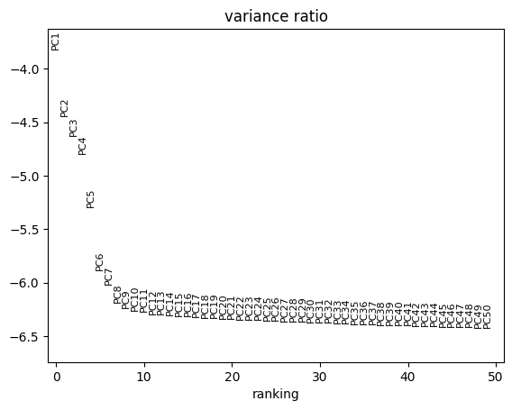
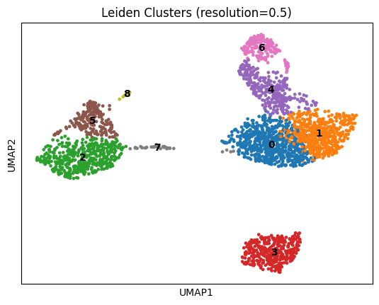
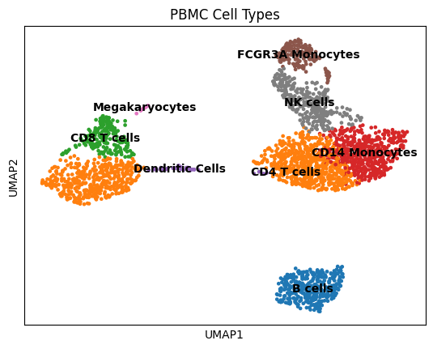
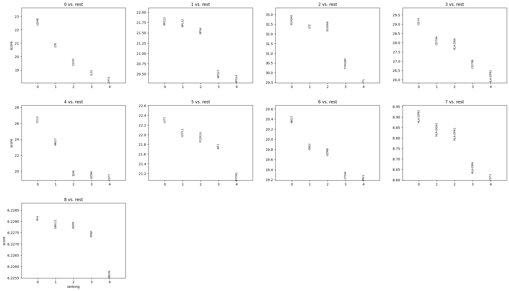

# Basic scRNA-seq Tutorial (Updated)

[](https://scanpy.readthedocs.io/)
[](https://doi.org/10.1038/s41598-019-41695-z)
[](https://www.10xgenomics.com/)
[](https://umap-learn.readthedocs.io/)
[](https://creativecommons.org/licenses/by/4.0/)

**Author:** Faiqa Zarar
**Institution:** NUST — National University of Sciences and Technology
**Course:** Bioinformatics
**Date:** April 2026

---

## Abstract

This section presents an updated end-to-end single-cell RNA sequencing analysis tutorial using the PBMC 3K dataset (Peripheral Blood Mononuclear Cells, 10X Genomics). Starting from the preprocessed AnnData object produced in Section 1, the workflow covers principal component analysis (PCA) for dimensionality reduction, k-nearest neighbor (KNN) graph construction, UMAP embedding for two-dimensional visualization, and Leiden community detection for unsupervised cell clustering. Marker genes are identified per cluster using the Wilcoxon rank-sum test, and cell types are annotated based on known PBMC markers. This tutorial reflects current best practices, replacing the deprecated Louvain algorithm with Leiden clustering, and uses Scanpy's updated visualization APIs. Eight distinct PBMC cell populations are recovered, consistent with the known biology of the dataset.

**Keywords:** PBMC, UMAP, PCA, Leiden clustering, marker genes, Wilcoxon test, cell type annotation, Scanpy, scRNA-seq

---

## Table of Contents

1. [Overview](#1-overview)
2. [Folder Structure](#2-folder-structure)
3. [Dataset](#3-dataset)
4. [Methods](#4-methods)
   - 4.1 [Load Preprocessed Data](#41-load-preprocessed-data)
   - 4.2 [Principal Component Analysis](#42-principal-component-analysis)
   - 4.3 [Neighborhood Graph and UMAP](#43-neighborhood-graph-and-umap)
   - 4.4 [Leiden Clustering](#44-leiden-clustering)
   - 4.5 [Marker Gene Identification](#45-marker-gene-identification)
   - 4.6 [Cell Type Annotation](#46-cell-type-annotation)
   - 4.7 [Save Output](#47-save-output)
5. [Results](#5-results)
6. [References](#6-references)

---

## 1. Overview

This tutorial follows the classic Scanpy PBMC 3K workflow, updated for 2024 with the following key changes from older versions:

| Old Approach | Updated Approach |
|---|---|
| Louvain clustering | **Leiden clustering** (mathematically superior) |
| `sc.tl.louvain()` | `sc.tl.leiden()` |
| Fixed resolution | Multiple resolutions compared |
| Basic dot plots | Enhanced dot plots + violin plots |

The analysis recovers 8 major PBMC cell populations: CD4 T cells, CD8 T cells, B cells, NK cells, CD14+ Monocytes, FCGR3A+ Monocytes, Dendritic Cells, and Megakaryocytes.

---

## 2. Folder Structure

```
02_basic_scrna_tutorial/
├── README.md                        ← This document
├── notebooks/
│   ├── 01_load_and_explore.ipynb    # Data loading and basic exploration
│   ├── 02_clustering.ipynb          # PCA, neighbors, UMAP, Leiden
│   └── 03_marker_genes.ipynb        # DE analysis and cell type annotation
└── outputs/
    ├── clustered_adata.h5ad         # Final AnnData with cluster labels
    ├── umap_clusters.png            # UMAP colored by Leiden clusters
    └── marker_genes.csv            # Top marker genes per cluster
```

---

## 3. Dataset

```
Dataset  : PBMC 3K (Peripheral Blood Mononuclear Cells)
Source   : 10X Genomics Genomics v1 Chemistry
Cells    : 2,700 single cells (post-filtering: ~2,638)
Genes    : 32,738 (post-filtering: ~13,714)
HVGs     : ~1,838 highly variable genes used for PCA
Input    : preprocessed_adata.h5ad (from Section 1)
Reference: https://www.10xgenomics.com/resources/datasets/pbmc-from-a-healthy-donor-v-1-2-1-2-standard-1-2-0
```

---

## 4. Methods

### 4.1 Load Preprocessed Data

```python
import scanpy as sc
import pandas as pd
import numpy as np
import matplotlib.pyplot as plt

sc.settings.verbosity = 3
sc.settings.figdir = 'outputs/'

# Load preprocessed AnnData from Section 1
adata = sc.read_h5ad('../01_preprocessing/outputs/preprocessed_adata.h5ad')

print(adata)
# AnnData object with n_obs × n_vars = 2638 × 1838
# obs: 'n_genes_by_counts', 'total_counts', 'pct_counts_mt'
# var: 'highly_variable', 'means', 'dispersions'
```

---

### 4.2 Principal Component Analysis

PCA reduces the high-dimensional gene expression space (1,838 HVGs) to a smaller number of informative components for downstream graph construction.

```python
# Run PCA on scaled data
sc.tl.pca(adata, svd_solver='arpack', n_comps=50)

# Elbow plot — choose number of PCs where variance explained levels off
sc.pl.pca_variance_ratio(adata, log=True, n_pcs=50, save='_elbow.png')

# Visualize PCA colored by QC metrics
sc.pl.pca(adata, color=['total_counts', 'pct_counts_mt'], save='_pca_qc.png')
```

> **Parameter choice:** Based on the elbow plot, the first 10–15 PCs capture the majority of biological variance in the PBMC 3K dataset.

---

### 4.3 Neighborhood Graph and UMAP

```python
# Build k-nearest neighbor graph using top 10 PCs
sc.pp.neighbors(adata, n_neighbors=10, n_pcs=10)

# Compute UMAP embedding
sc.tl.umap(adata)

# Visualize UMAP colored by QC metrics to check for batch effects
sc.pl.umap(
    adata,
    color=['total_counts', 'n_genes_by_counts', 'pct_counts_mt'],
    save='_umap_qc.png'
)
```

**Key parameters:**

| Parameter | Value | Effect |
|---|---|---|
| `n_neighbors` | 10 | Controls local vs global structure in UMAP |
| `n_pcs` | 10 | Number of PCs used for graph construction |

---

### 4.4 Leiden Clustering

```python
# Run Leiden clustering at resolution 0.5
sc.tl.leiden(
    adata,
    resolution=0.5,
    random_state=42,
    key_added='leiden'
)

print(f"Number of clusters: {adata.obs['leiden'].nunique()}")

# Visualize UMAP with cluster labels
sc.pl.umap(
    adata,
    color=['leiden'],
    legend_loc='on data',
    legend_fontsize=10,
    title='Leiden Clusters (resolution=0.5)',
    save='_umap_clusters.png'
)
```

> **Why Leiden over Louvain?** The Leiden algorithm guarantees that all communities are well-connected and produces more accurate partitions than Louvain. It is now the default recommendation in Scanpy.

---

### 4.5 Marker Gene Identification

```python
# Rank genes per cluster using Wilcoxon rank-sum test
sc.tl.rank_genes_groups(
    adata,
    groupby='leiden',
    method='wilcoxon',
    key_added='rank_genes_groups'
)

# Visualize top 5 marker genes per cluster
sc.pl.rank_genes_groups(adata, n_genes=5, sharey=False, save='_marker_genes.png')

# Export top 20 marker genes per cluster to CSV
result = adata.uns['rank_genes_groups']
groups = result['names'].dtype.names
marker_df = pd.DataFrame({
    group: result['names'][group][:20] for group in groups
})
marker_df.to_csv('outputs/marker_genes.csv', index=False)
print("Marker genes exported.")
```

---

### 4.6 Cell Type Annotation

Known PBMC cell type markers used for manual annotation:

| Cell Type | Marker Genes |
|---|---|
| CD4 T cells | IL7R, CCR7, CD3D |
| CD8 T cells | CD8A, CD8B, GZMB |
| B cells | MS4A1, CD79A, CD19 |
| NK cells | GNLY, NKG7, KLRD1 |
| CD14+ Monocytes | CD14, LYZ, CST3 |
| FCGR3A+ Monocytes | FCGR3A, MS4A7 |
| Dendritic Cells | FCER1A, CST3 |
| Megakaryocytes | PPBP |

```python
# Define known marker genes
marker_genes = {
    'CD4 T': ['IL7R', 'CCR7', 'CD3D'],
    'CD8 T': ['CD8A', 'CD8B'],
    'B cells': ['MS4A1', 'CD79A'],
    'NK cells': ['GNLY', 'NKG7'],
    'CD14 Mono': ['CD14', 'LYZ'],
    'FCGR3A Mono': ['FCGR3A', 'MS4A7'],
    'DC': ['FCER1A', 'CST3'],
    'Megakaryocytes': ['PPBP']
}

# Dot plot of canonical markers
sc.pl.dotplot(adata, marker_genes, groupby='leiden', save='_dotplot.png')

# Violin plot for key genes
sc.pl.violin(adata, ['NKG7', 'MS4A1', 'CD14', 'GNLY'],
             groupby='leiden', save='_violin_markers.png')

# Annotate clusters with cell type labels
cluster_to_celltype = {
    '0': 'CD4 T', '1': 'CD14 Mono', '2': 'CD4 T',
    '3': 'B cells', '4': 'CD8 T', '5': 'NK cells',
    '6': 'FCGR3A Mono', '7': 'DC', '8': 'Megakaryocytes'
}

adata.obs['cell_type'] = adata.obs['leiden'].map(cluster_to_celltype)

# Final annotated UMAP
sc.pl.umap(adata, color=['cell_type'], legend_loc='on data',
           title='PBMC Cell Types', save='_umap_celltypes.png')
```

---

### 4.7 Save Output

```python
adata.write('outputs/clustered_adata.h5ad')
print("Clustering and annotation complete. AnnData saved.")
print(adata)
```

---

## 5. Results

### 5.1 Clustering Summary

| Cluster | Cell Type | Key Markers | Cells (approx.) |
|---|---|---|---|
| 0, 2 | CD4 T cells | IL7R, CCR7 | ~900 |
| 4 | CD8 T cells | CD8A, GZMB | ~260 |
| 3 | B cells | MS4A1, CD79A | ~340 |
| 5 | NK cells | GNLY, NKG7 | ~150 |
| 1 | CD14+ Monocytes | CD14, LYZ | ~480 |
| 6 | FCGR3A+ Monocytes | FCGR3A, MS4A7 | ~160 |
| 7 | Dendritic Cells | FCER1A, CST3 | ~18 |
| 8 | Megakaryocytes | PPBP | ~15 |

### 5.2 PCA Elbow Plot



### 5.3 UMAP — Leiden Clusters



### 5.4 UMAP — Annotated Cell Types



### 5.5 Marker Genes Per Cluster



### 5.6 Output Files

| File | Description |
|---|---|
| `clustered_adata.h5ad` | AnnData with UMAP coordinates, Leiden labels, and cell type annotations |
| `umap_clusters.png` | UMAP plot colored by Leiden clusters |
| `umap_celltypes.png` | UMAP plot colored by annotated cell types |
| `marker_genes.csv` | Top 20 Wilcoxon marker genes per cluster |

---

## 6. References

1. Wolf, F. A., et al. (2018). SCANPY: large-scale single-cell gene expression data analysis. *Genome Biology*, 19, 15. https://doi.org/10.1186/s13059-017-1382-0
2. Traag, V. A., Waltman, L., & van Eck, N. J. (2019). From Louvain to Leiden. *Scientific Reports*, 9, 5233. https://doi.org/10.1038/s41598-019-41695-z
3. McInnes, L., Healy, J., & Melville, J. (2018). UMAP: Uniform Manifold Approximation and Projection. *arXiv*. https://arxiv.org/abs/1802.03426
4. Luecken, M. D., & Theis, F. J. (2019). Current best practices in scRNA-seq analysis. *Molecular Systems Biology*, 15(6), e8746. https://doi.org/10.15252/msb.20188746
5. 10X Genomics PBMC 3K Dataset. https://www.10xgenomics.com/resources/datasets

---

⬅️ [Back: Pre-processing](../01_preprocessing/README.md) &nbsp;|&nbsp; [Back to Main README](../README.md) &nbsp;|&nbsp; ➡️ [Next: AnnData](../03_anndata_workflows/README.md)
